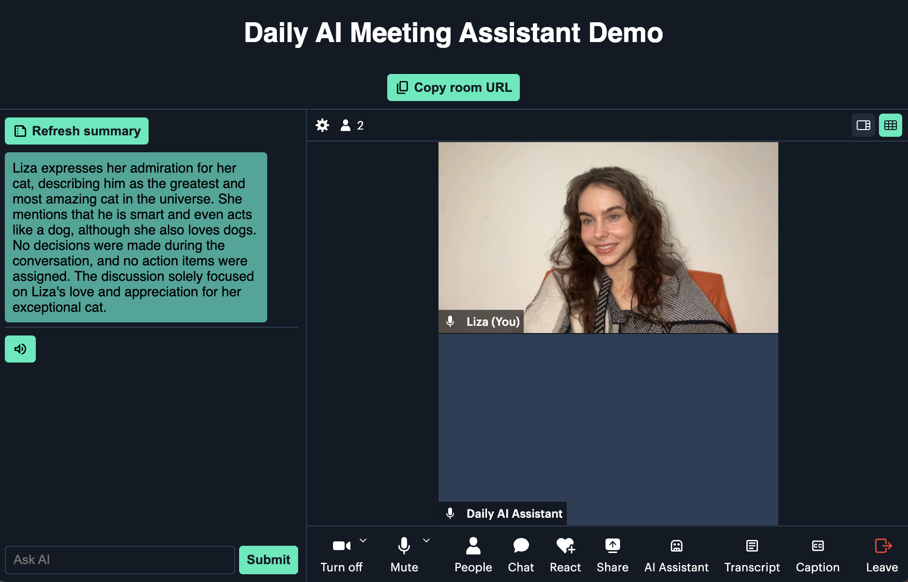

# Daily AI Meeting Assistant Demo

This demo shows how to build and run an AI meeting assistant based on Daily's transcription API alongside an embedded Prebuilt call.



## How it works

The server component uses [Daily's Python SDK](https://docs.daily.co/reference/daily-python) to join any Daily room with a bot assistant. 
The server component configures an AI _assistant_ (in this case powered by OpenAI) for each session.
Each incoming transcription line is stored. At regular intervals, raw transcription lines are cleaned up through an OpenAI request. The clean transcript is accessible to the client for display and is also used as the context for subequent meeting summary and custom queries. 

When a session is queried via an [`"app-message"` event](https://docs.daily.co/reference/daily-js/events/participant-events#app-message), the Python assistant bot uses the stored transcription lines to generate a response from the OpenAI assistant.

## Getting started

### Sign up for Daily

* [Sign up for Daily](https://dashboard.daily.co/u/signup)
* In your dashboard, unlock Daily's [usage-based pricing upgrade](https://dashboard.daily.co/billing). You will receive a $15 credit to test Daily's features, including real-time transcription.
* Create a [Daily room](https://dashboard.daily.co/rooms/create) to use for the demo.

### Sign up for OpenAI
* [Sign up for OpenAI](https://platform.openai.com/signup) and retrieve an OpenAI API key.

### Running the server

In the root of the repository on your local machine, run the following commands:

1. `python3 -m venv venv`
1. `source venv/bin/activate`

In the virtual environment, run the following to install requirements and run the server:

1. `pip install -r server/requirements.txt`
1. `quart --app server/main.py --debug run`

### Running the client

In another terminal window, run the following:

1. Navigate to the client directory: `cd client`
1. Install dependencies with `yarn install`
1. Start the dev server with `yarn dev`

Open the displayed localhost port in your browser. Fill in your Daily room URL, [Daily API key](https://dashboard.daily.co/developers), and OpenAI API key.

## Running the AI assistant bot in headless mode

If you'd like to use the AI assistant bot with your own client implementation, you can start it as follows:

```
python -m server.call.session --room_url "YOUR_DAILY_ROOM_URL" --oai_api_key="YOUR_OPENAI_API_KEY"
```

Run `python -m server.call.session --help` for a full list of options.

## Production considerations

### Storage layer
All transcription lines are currently stored in memory. In a production environment, consider using a more scalable
storage solution.

### OpenAI context optimization
For a production use case, optimizations can be made for how context is stored and updated. For example, context can be
strategically batched and discarded when no longer required. The appropriate approach will depend on your use case.